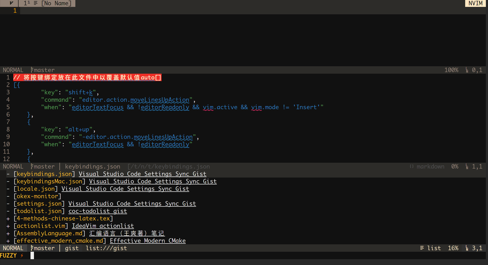

# coc-gist


[](https://badge.fury.io/js/coc-gist)

Gist extension for [coc.nvim](https://github.com/neoclide/coc.nvim)



## Install

```
:CocInstall coc-gist
```

## Commands

- `:CocCommand gist.create`: create a new gist
- `:CocCommand gist.update`: create a new gist

## CocList

`:CocList gist`

- `open`
- `append`
- `preview`
- `update`
- `delete`
- `browserOpen`

## License

MIT
